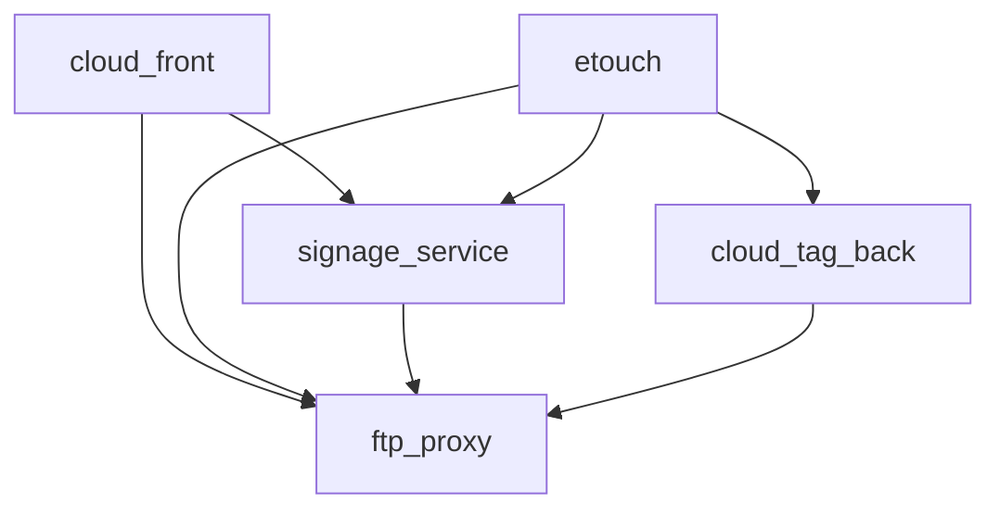

# Comando /bootstrap

Inicializa el workspace multi-repo detectando automáticamente todos los repos y generando metadata (AGENTS.md) por cada uno.

## Workflow

### 1. Auto-Detect Repos

Buscar repos en workspace:
```bash
# Detectar carpetas con package.json (Node/JS/TS)
find . -maxdepth 2 -name "package.json" -type f \
  ! -path "*/node_modules/*" ! -path "*/.git/*" ! -path "*/.opencode/*" \
  -exec dirname {} \;

# Detectar carpetas con Cargo.toml (Rust)
find . -maxdepth 2 -name "Cargo.toml" -type f -exec dirname {} \;

# Detectar carpetas con pom.xml (Java/Maven)
find . -maxdepth 2 -name "pom.xml" -type f -exec dirname {} \;

# Detectar carpetas con go.mod (Go)
find . -maxdepth 2 -name "go.mod" -type f -exec dirname {} \;

# Detectar carpetas con .git (repos sin marker file conocido)
find . -maxdepth 2 -type d -name ".git" -exec dirname {} \;
```

**Output**: Lista de repos detectados

```
Found 5 repos:
  - cloud_front (Node/TypeScript)
  - signage_service (Node/TypeScript)
  - ftp_proxy (Rust)
  - etouch (Node/TypeScript)
  - cloud_tag_back (Node/TypeScript)
```

### 2. Delegar a bootstrap-scout POR CADA REPO

**Lanzar EN PARALELO** (un mensaje, N tasks) bootstrap-scout para cada repo:
```
Task: bootstrap-scout para <repo1>
Task: bootstrap-scout para <repo2>
Task: bootstrap-scout para <repo3>
...
```

Cada bootstrap-scout:
1. Lee package.json (si existe)
2. Detecta stack:
   - Framework: React, Vue, Svelte, Next.js, Express, Fastify, etc.
   - Language: TypeScript, JavaScript, Rust, Go, Java
   - Package manager: pnpm, npm, yarn, bun, cargo, go mod
3. Lista scripts disponibles (lint, typecheck, test, build, dev, start)
4. Lee README.md (primeras 20 líneas para descripción)
5. Identifica entrypoints: src/index.ts, src/main.ts, main.go, src/main.rs
6. Detecta características especiales:
   - Monorepo: workspaces en package.json
   - Tests: directorio tests/ o __tests__/
   - Docs: directorio docs/
   - CI: .github/workflows/

### 3. Generar AGENTS.md por Repo

Por cada repo, crear `<repo>/AGENTS.md`:

```md
# <Repo Name>

## Stack
- Language: TypeScript
- Framework: Next.js 14 (App Router)
- Package Manager: pnpm
- Node Version: 20.x

## Scripts (Gate Commands)
- lint: ✅ `pnpm lint`
- typecheck: ✅ `pnpm typecheck`
- test: ✅ `pnpm test`
- build: ✅ `pnpm build`
- dev: `pnpm dev`

## Entrypoints
- Main: src/app/layout.tsx
- API: src/app/api/**/*.ts
- Components: src/components/**/*.tsx

## Architecture
- Router: App Router (Next.js 14)
- State: React Context + hooks
- Styling: Tailwind CSS
- API Client: fetch + React Query

## Notes
- Monorepo: No
- Tests: Vitest + React Testing Library
- CI: GitHub Actions (.github/workflows/ci.yml)

## Description
<primeras líneas del README>
```

### 4. Generar Service Catalog (Opcional)

Crear `worklog/service-catalog.md`:

```md
# Service Catalog

Date: 2026-01-15

## Repos Overview

| Repo | Type | Stack | Scripts | Notes |
|------|------|-------|---------|-------|
| cloud_front | Frontend | Next.js 14 + TS | lint, typecheck, build, test | App Router |
| signage_service | Backend API | Fastify + TS | lint, typecheck, build, test | REST API |
| ftp_proxy | Proxy | Rust + Actix | check, build, test | FTP signed URLs |
| etouch | Frontend | React + TS | lint, typecheck, build, test | SPA |
| cloud_tag_back | Backend API | Express + TS | lint, typecheck, build | REST API |

## Dependencies



## Contracts (Known)

### signage_service
- GET /api/catalogos → CatalogoDTO[]
- POST /api/auth/login → { token: string }

### cloud_tag_back
- GET /api/articulos?catalogo=<id> → ArticuloDTO[]

### ftp_proxy
- GET /signed/<path> → Signed URL redirect
```

### 5. Sugerir Setup Supermemory (Opcional)

```
✅ Bootstrap completed.

📁 AGENTS.md generated for 5 repos
📊 Service catalog: worklog/service-catalog.md

💡 Recommended: Run /supermemory-init to index this workspace
```

---

## Flags opcionales

- `/bootstrap` - forma básica (detecta todos los repos)
- `/bootstrap --skip-catalog` - skip service catalog generation

---

## Output esperado

```
🔍 Detecting repos in workspace...
   Found 5 repos:
   - cloud_front (Node/TypeScript)
   - signage_service (Node/TypeScript)
   - ftp_proxy (Rust)
   - etouch (Node/TypeScript)
   - cloud_tag_back (Node/TypeScript)

👷 Analyzing repos (parallel)...
   - bootstrap-scout cloud_front: ✅
   - bootstrap-scout signage_service: ✅
   - bootstrap-scout ftp_proxy: ✅
   - bootstrap-scout etouch: ✅
   - bootstrap-scout cloud_tag_back: ✅

📝 Generating AGENTS.md...
   - cloud_front/AGENTS.md: ✅
   - signage_service/AGENTS.md: ✅
   - ftp_proxy/AGENTS.md: ✅
   - etouch/AGENTS.md: ✅
   - cloud_tag_back/AGENTS.md: ✅

📊 Generating service catalog...
   - worklog/service-catalog.md: ✅

✅ Bootstrap completed!

💡 Recommended next steps:
   1. Review AGENTS.md files in each repo
   2. Run /supermemory-init to index workspace
   3. Run /task <name> to start your first multi-repo task
```

---

## Notas

- AGENTS.md se puede editar manual después para agregar detalles específicos
- Service catalog es útil para onboarding de nuevos devs
- Si un repo ya tiene AGENTS.md, pregunta: "¿Override?"
- bootstrap-scout debe ser tolerante a fallos (skip repo si no puede analizar)
