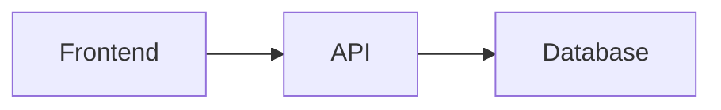

# Documentation Sync Skill

Detecta y corrige **drift** (desincronización) entre código y documentación. Valida que README files, docs/, ejemplos de código, API signatures, y diagramas de arquitectura estén actualizados con el código real.

## Cuándo Usar

AUTO-TRIGGER cuando:
- Después de implementar cambios en APIs
- Después de refactorings arquitectónicos
- En `/wrap` antes de cerrar task
- User menciona: "update docs", "sync documentation", "outdated README"
- Cambios en: endpoints, DTOs, interfaces públicas, arquitectura

## Features

✅ **Drift Detection** en:
- API signatures en README vs código
- Ejemplos en docs que no compilan
- Diagramas de arquitectura desactualizados
- Changelog sin entrada nueva
- Comentarios de código obsoletos
- Links rotos en documentación

✅ **Validation Checklist**:
- [ ] API signatures coinciden (method, params, return type)
- [ ] Ejemplos en docs compilan y corren
- [ ] Diagramas de arquitectura actualizados
- [ ] Changelog con entrada para cambios
- [ ] README refleja cambios en features
- [ ] Links internos y externos funcionan

✅ **Output**: Lista de drift issues con severity + suggested fixes

---

## Workflow de Detección

### Step 1: Identify Documentation Files

Buscar archivos de documentación en el proyecto:

```bash
# README files
find . -name "README.md" -o -name "README.txt" -not -path "*/node_modules/*"

# Docs directory
ls -la docs/

# API documentation
find . -name "API.md" -o -name "api.md" -not -path "*/node_modules/*"

# Changelogs
find . -name "CHANGELOG.md" -o -name "CHANGES.md"

# Architecture diagrams
find . -name "*.mmd" -o -name "architecture.md"
```

### Step 2: Analyze Code Changes

Obtener cambios recientes desde git:

```bash
# Ver archivos modificados en el último commit
git diff HEAD~1 --name-only

# Ver diff de archivos específicos
git diff HEAD~1 src/api/users.ts

# Ver cambios en interfaces/DTOs
git diff HEAD~1 -- "*.interface.ts" "*.dto.ts"
```

### Step 3: Check API Signatures

Validar que API signatures documentadas coincidan con código:

**Ejemplo de Drift**:

**README.md** dice:
```typescript
// GET /api/users/:id
// Returns: User
interface User {
  id: string;
  name: string;
  email: string;
}
```

**Código actual** (`src/api/users.ts`):
```typescript
// ❌ DRIFT: Field "role" agregado pero README no actualizado
interface User {
  id: string;
  name: string;
  email: string;
  role: 'admin' | 'user';  // NEW FIELD
}
```

**Detection**:
```
❌ DRIFT DETECTED

File: README.md:42
Issue: API signature outdated
Severity: HIGH

Expected (from code):
  interface User {
    id: string;
    name: string;
    email: string;
    role: 'admin' | 'user';
  }

Found (in README):
  interface User {
    id: string;
    name: string;
    email: string;
  }

Suggested Fix: Update README.md line 42 to include "role" field
```

---

### Step 4: Validate Code Examples

Verificar que ejemplos en docs compilan:

**Ejemplo de Drift**:

**docs/usage.md** tiene:
```typescript
import { createUser } from './api';

// ❌ DRIFT: Función renombrada pero ejemplo no actualizado
const user = createUser({ name: 'John', email: 'john@example.com' });
```

**Código actual**:
```typescript
// Función renombrada a `registerUser`
export function registerUser(data: UserInput): User {
  // ...
}
```

**Detection**:
```
❌ DRIFT DETECTED

File: docs/usage.md:12
Issue: Function renamed
Severity: CRITICAL (example won't compile)

Old name: createUser (in docs)
New name: registerUser (in code)

Suggested Fix: Replace "createUser" with "registerUser" in docs/usage.md
```

---

### Step 5: Check Architecture Diagrams

Validar que diagramas reflejen arquitectura actual:

**Ejemplo de Drift**:

**docs/architecture.md** tiene:


**Código actual** tiene:
- Frontend → API → Redis Cache → Database (nueva capa de cache)

**Detection**:
```
⚠️ DRIFT DETECTED

File: docs/architecture.md
Issue: Diagram missing Redis cache layer
Severity: MEDIUM

Current architecture includes Redis cache between API and Database,
but diagram doesn't show this layer.

Suggested Fix: Add Redis node to diagram:
  Frontend --> API
  API --> Redis
  Redis --> Database
```

---

### Step 6: Check Changelog

Validar que CHANGELOG.md tenga entrada para cambios:

**Detection**:
```bash
# Ver último commit
LAST_COMMIT=$(git log -1 --pretty=format:"%s")

# Ver si CHANGELOG.md se actualizó
if ! git diff HEAD~1 CHANGELOG.md | grep -q "$LAST_COMMIT"; then
  echo "⚠️ DRIFT: CHANGELOG.md no actualizado para último commit"
fi
```

**Output**:
```
⚠️ DRIFT DETECTED

File: CHANGELOG.md
Issue: Missing entry for recent changes
Severity: LOW

Recent commits without changelog entry:
- feat: Add role field to User interface
- fix: Update registerUser function signature

Suggested Fix: Add entry to CHANGELOG.md under [Unreleased] or [v2.1.0]
```

---

## Checklist de Validación

### API Documentation

- [ ] **Endpoint paths** en docs coinciden con rutas en código
- [ ] **HTTP methods** (GET/POST/PUT/DELETE) correctos
- [ ] **Request body** schemas actualizados
- [ ] **Response** schemas actualizados
- [ ] **Query params** documentados
- [ ] **Headers** requeridos documentados
- [ ] **Status codes** documentados (200, 400, 404, 500)

### Code Examples

- [ ] **Imports** usan paths correctos
- [ ] **Function names** coinciden con código
- [ ] **Parameters** correctos (orden, tipos, opcionales)
- [ ] **Return types** correctos
- [ ] **Ejemplos compilan** sin errores
- [ ] **Ejemplos corren** sin errores

### Architecture Documentation

- [ ] **Diagramas** reflejan arquitectura actual
- [ ] **Componentes** listados existen en código
- [ ] **Dependencias** entre componentes correctas
- [ ] **Data flow** actualizado
- [ ] **Tech stack** actualizado

### README

- [ ] **Installation** steps actualizados
- [ ] **Configuration** options actualizadas
- [ ] **Usage examples** funcionan
- [ ] **Features list** actualizada
- [ ] **API reference** actualizada
- [ ] **Links** funcionan (no 404)

### Changelog

- [ ] **Recent changes** documentados
- [ ] **Version** actualizada
- [ ] **Breaking changes** marcados
- [ ] **Migration guide** si aplica

---

## Severity Levels

| Severity | Description | Action |
|----------|-------------|--------|
| **CRITICAL** | Ejemplos no compilan, endpoints incorrectos | BLOQUEA merge - fix inmediato |
| **HIGH** | API signatures diferentes, parámetros incorrectos | Review requerida |
| **MEDIUM** | Diagramas desactualizados, features no listadas | Fix antes de release |
| **LOW** | Changelog vacío, typos en docs | Nice-to-have |

---

## Integration con Workflow

### En /wrap (Scribe)

Scribe ejecuta documentation-sync antes de finalizar:

```
@scribe en /wrap catalogos:

1. Ejecutar oc-wrap catalogos (snapshot + commits)
2. AUTO-TRIGGER documentation-sync:
   - Lee README.md, docs/, CHANGELOG.md
   - Compara con git diff
   - Detecta drift
3. Si drift CRITICAL o HIGH:
   - BLOQUEAR wrap
   - Reportar issues
   - Sugerir fixes
4. Si drift MEDIUM o LOW:
   - Advertir user
   - Preguntar: "¿Fix ahora o después?"
```

### En Review Phase

Reviewer puede invocar manualmente:

```
@reviewer:

Antes de PASS, verificar:
1. Ejecutar documentation-sync
2. Si drift encontrado:
   - FAIL review
   - Reportar issues a builder
3. Builder corrige docs
4. Re-run documentation-sync
5. Si OK → PASS
```

---

## Output Example

```
🔍 Documentation Sync Check

Analyzing 5 documentation files...
- README.md
- docs/api.md
- docs/architecture.md
- CHANGELOG.md
- package.json (description)

✅ No drift detected (3 files)
- docs/architecture.md: Up to date
- CHANGELOG.md: Entry exists for v2.1.0
- package.json: Description matches

❌ Drift detected (2 files)

1. README.md:42 (HIGH)
   API signature outdated
   Expected: User interface with "role" field
   Found: User interface without "role" field
   Fix: Add "role: 'admin' | 'user';" to interface

2. docs/api.md:78 (CRITICAL)
   Function renamed
   Old name: createUser (in docs)
   New name: registerUser (in code)
   Fix: Replace "createUser" with "registerUser"

⚠️ BLOCKING ISSUES: 1 CRITICAL, 1 HIGH

Suggested fixes:
────────────────────────────────────────
README.md:42 - Add role field:
  interface User {
    id: string;
    name: string;
    email: string;
+   role: 'admin' | 'user';
  }

docs/api.md:78 - Update function name:
- import { createUser } from './api';
+ import { registerUser } from './api';
────────────────────────────────────────

Action required: Fix drift before merge
```

---

## Script Helper (Optional)

Script para automatizar detección:

```bash
#!/usr/bin/env bash
# scripts/oc-docs-sync

set -euo pipefail

TASK="${1:-}"
SEVERITY="${2:-HIGH}"  # CRITICAL, HIGH, MEDIUM, LOW

echo "🔍 Checking documentation sync..."

# Find doc files
DOC_FILES=$(find . -name "README.md" -o -name "*.md" -path "*/docs/*" | grep -v node_modules)

# Get recent changes
CHANGED_FILES=$(git diff HEAD~1 --name-only | grep -E '\.(ts|js|tsx|jsx)$' || true)

if [[ -z "$CHANGED_FILES" ]]; then
  echo "✅ No code changes detected"
  exit 0
fi

echo "Code files changed:"
echo "$CHANGED_FILES"
echo ""

# Check for API changes
API_CHANGES=$(git diff HEAD~1 | grep -E '(interface|type|function|export)' || true)

if [[ -n "$API_CHANGES" ]]; then
  echo "⚠️ API changes detected - docs may need update"
  echo ""
  echo "Checking docs..."

  # Simple check: look for function names in docs
  for file in $DOC_FILES; do
    echo "  Checking $file..."
    # Add actual validation logic here
  done
fi

echo ""
echo "✅ Documentation sync check complete"
```

---

## Best Practices

1. **Run after every API change** - Prevent drift from accumulating
2. **Automate in CI** - Add to GitHub Actions workflow
3. **Block PRs with CRITICAL drift** - Enforce docs quality
4. **Update diagrams first** - Architecture changes should update diagrams before code
5. **Keep examples minimal** - Fewer examples = less drift risk
6. **Use linters** - ESLint for TS/JS examples, markdownlint for docs
7. **Link to code** - Use relative links to source files in docs

---

## Notas

- **False positives**: Algunos cambios son intencionalmente no documentados (internals)
- **Whitelist**: Permitir ciertos files/folders ignorar drift check
- **Auto-fix**: Para typos y links rotos, auto-fix puede aplicarse
- **Manual review**: Cambios arquitectónicos requieren human review de diagramas

---

## Referencias

- **Source**: SkillsMP - benreceveur documentation-sync
- **Related**: SkillsMP - alexei-led looking-up-docs (para buscar docs oficiales)
- **Tools**: markdownlint, remark-lint, broken-link-checker

---

**Version**: 1.0
**Maintainer**: OpenCode Kit
**Last Updated**: 2026-01-15
